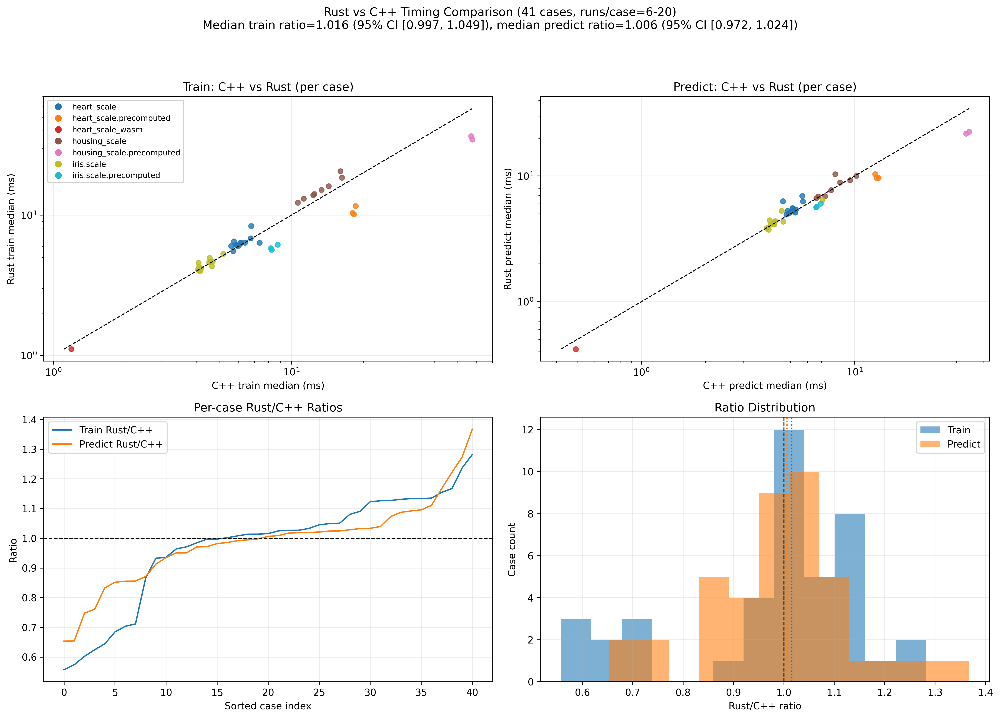

# libsvm-rs

`libsvm-rs` is a pure Rust implementation of [LIBSVM](https://github.com/cjlin1/libsvm) (v337, December 2025) focused on scientific reproducibility and upstream parity. It preserves LIBSVM model format and CLI behavior, ships reproducible Rust-vs-C/C++ comparison pipelines (including figures and benchmark summaries), and targets numerical equivalence (typically around `1e-8` tolerance) rather than bitwise identity against the upstream reference implementation.

[](https://crates.io/crates/libsvm-rs)
[](https://docs.rs/libsvm-rs)
[](https://github.com/ricardofrantz/libsvm-rs/actions)
[](LICENSE)

## Features

- **All 5 SVM types**: C-SVC, nu-SVC, one-class SVM, epsilon-SVR, nu-SVR (`-s 0..4`)
- **All 5 kernel types**: linear, polynomial, RBF, sigmoid, precomputed (`-t 0..4`)
- **Model file compatibility**: reads and writes LIBSVM text format with `%.17g` precision, so models trained with the C library can be loaded in Rust and vice versa
- **Probability estimation** (`-b 1`): Platt scaling for binary classification, pairwise coupling for multiclass, Laplace-corrected predictions for regression, density-based marks for one-class
- **Cross-validation**: stratified k-fold for classification (preserves class proportions), simple k-fold for regression/one-class
- **CLI tools**: `svm-train-rs`, `svm-predict-rs`, `svm-scale-rs` — drop-in replacements matching upstream flag syntax
- **Minimal dependencies**: zero runtime deps beyond `thiserror`; `rayon` is feature-gated for future parallel cross-validation
- **Verification pipeline**: upstream parity locked to LIBSVM v337 with 250-configuration differential testing across all SVM types, kernel types, datasets, and parameter variations

## Installation

### As a library

```toml
[dependencies]
libsvm-rs = "0.6"
```

### CLI tools

```bash
# Clone and build from source (CLIs are workspace members, not published separately)
git clone https://github.com/ricardofrantz/libsvm-rs.git
cd libsvm-rs
cargo build --release -p svm-train-rs -p svm-predict-rs -p svm-scale-rs
# Binaries are in target/release/
```

## Quick Start

### Library API

```rust
use libsvm_rs::io::{load_problem, save_model, load_model};
use libsvm_rs::predict::{predict, predict_values};
use libsvm_rs::train::svm_train;
use libsvm_rs::{KernelType, SvmParameter, SvmType};
use std::path::Path;

// Load training data in LIBSVM sparse format
let problem = load_problem(Path::new("data/heart_scale")).unwrap();

// Configure parameters (defaults match LIBSVM)
let mut param = SvmParameter::default();
param.svm_type = SvmType::CSvc;
param.kernel_type = KernelType::Rbf;
param.gamma = 1.0 / 13.0;  // 1/num_features
param.c = 1.0;

// Train
let model = svm_train(&problem, &param);

// Predict a single instance
let label = predict(&model, &problem.instances[0]);
println!("predicted label: {label}");

// Get decision values (useful for ranking or custom thresholds)
let mut dec_values = vec![0.0f64; model.nr_class * (model.nr_class - 1) / 2];
let label = predict_values(&model, &problem.instances[0], &mut dec_values);
println!("decision values: {dec_values:?}");

// Save/load models (compatible with C LIBSVM format)
save_model(Path::new("heart_scale.model"), &model).unwrap();
let loaded = load_model(Path::new("heart_scale.model")).unwrap();
```

### Cross-Validation

```rust
use libsvm_rs::cross_validation::svm_cross_validation;

let targets = svm_cross_validation(&problem, &param, 5);  // 5-fold CV
let accuracy = targets.iter().zip(&problem.labels)
    .filter(|(pred, actual)| (*pred - *actual).abs() < 1e-10)
    .count() as f64 / problem.labels.len() as f64;
println!("CV accuracy: {:.2}%", accuracy * 100.0);
```

### Probability Estimation

```rust
use libsvm_rs::predict::predict_probability;

// Enable probability estimation during training
let mut param = SvmParameter::default();
param.probability = true;
param.kernel_type = KernelType::Rbf;
param.gamma = 1.0 / 13.0;

let model = svm_train(&problem, &param);
if let Some((label, probs)) = predict_probability(&model, &problem.instances[0]) {
    println!("label: {label}, class probabilities: {probs:?}");
}
```

### Extended Examples

For structured, runnable example suites see:

- `examples/README.md` — index of all examples
- `examples/basics/` — minimal starter examples
- `examples/api/` — persistence, CV/grid-search, Iris workflow
- `examples/integrations/` — prediction server + wasm inference integrations
- `examples/scientific/` — benchmark-heavy Rust-vs-C++ demos

## CLI Usage

The CLI tools accept the same flags as upstream LIBSVM:

### svm-train-rs

```bash
# Default C-SVC with RBF kernel
svm-train-rs data/heart_scale

# nu-SVC with linear kernel, 5-fold cross-validation
svm-train-rs -s 1 -t 0 -v 5 data/heart_scale

# epsilon-SVR with RBF, custom C and gamma
svm-train-rs -s 3 -t 2 -c 10 -g 0.1 data/heart_scale

# With probability estimation
svm-train-rs -b 1 data/heart_scale

# With class weights for imbalanced data
svm-train-rs -w1 2.0 -w-1 0.5 data/heart_scale

# Quiet mode (suppress training progress)
svm-train-rs -q data/heart_scale
```

### svm-predict-rs

```bash
# Standard prediction
svm-predict-rs test_data model_file output_file

# With probability estimates
svm-predict-rs -b 1 test_data model_file output_file

# Quiet mode
svm-predict-rs -q test_data model_file output_file
```

### svm-scale-rs

```bash
# Scale features to [0, 1]
svm-scale-rs -l 0 -u 1 data/heart_scale > scaled.txt

# Scale to [-1, 1] (default)
svm-scale-rs data/heart_scale > scaled.txt

# Save scaling parameters for later use on test data
svm-scale-rs -s range.txt data/heart_scale > train_scaled.txt
svm-scale-rs -r range.txt data/test_data > test_scaled.txt

# Scale specific feature range
svm-scale-rs -l 0 -u 1 -y -1 1 data/heart_scale > scaled.txt
```

---

## Verification Pipeline

### Overview

Upstream parity is locked to LIBSVM `v337` (December 2025) via `reference/libsvm_upstream_lock.json`. The differential verification suite builds the upstream C binary from a pinned Git commit, runs both implementations on identical datasets with identical parameters, and compares:

- **Prediction labels**: exact match for classification, tolerance-bounded for regression
- **Decision values**: relative and absolute tolerance checks
- **Model structure**: number of SVs, rho values, sv_coef values
- **Probability outputs**: probA/probB parameters, probability predictions

### Running Verification

```bash
# 1. Validate that the upstream lock file is consistent
bash scripts/check_libsvm_reference_lock.sh

# 2. Build the pinned upstream C reference binary and record provenance
bash scripts/setup_reference_libsvm.sh

# 3. Run differential verification
#    Quick scope: 45 configs (canonical datasets × SVM types × kernel types)
python3 scripts/run_differential_suite.py

#    Full scope: 250 configs (canonical + generated + tuned parameters)
DIFF_SCOPE=full python3 scripts/run_differential_suite.py

#    Strict mode: disable the targeted SVR warning downgrade
DIFF_ENABLE_TARGETED_SVR_WARN=0 DIFF_SCOPE=full python3 scripts/run_differential_suite.py

#    Sensitivity study: override the global non-probability relative tolerance
DIFF_NONPROB_REL_TOL=2e-5 DIFF_SCOPE=full python3 scripts/run_differential_suite.py

# 4. Run coverage gate (checks line and function coverage thresholds)
bash scripts/check_coverage_thresholds.sh

# 5. Run Rust-vs-C performance benchmarks
BENCH_WARMUP=3 BENCH_RUNS=30 python3 scripts/benchmark_compare.py
```

### Understanding Differential Results

| Verdict | Meaning |
|---------|---------|
| `pass`  | No parity issues detected under configured tolerances |
| `warn`  | Non-fatal differences detected under explicit, documented policy rules |
| `fail`  | Deterministic parity break — label mismatch or model divergence outside thresholds |
| `skip`  | Configuration not executed (usually because training fails in both implementations) |

**Current status** (full scope, 250 configs): **236 pass, 4 warn, 0 fail, 10 skip**.

The 4 warnings are:
1. `housing_scale_s3_t2_tuned` — epsilon-SVR near-parity training drift (bounded, cross-predict verified)
2. `gen_regression_sparse_scale_s4_t3_tuned` — probability header (`probA`) drift
3. `gen_extreme_scale_scale_s0_t1_default` — rho-only near-equivalence drift
4. `gen_extreme_scale_scale_s2_t1_default` — one-class near-boundary label drift

All 10 skips are `nu_svc` on synthetic `gen_binary_imbalanced.scale` where both C and Rust fail training identically.

The active tolerance policy is `differential-v3` (documented in `reference/tolerance_policy.md`).

### Targeted Warning Policy

The epsilon-SVR warning for `housing_scale_s3_t2_tuned` has an intentionally narrow guard:

- Applies to **one case ID only**
- Non-probability drift bounds must hold: `max_rel <= 6e-5`, `max_abs <= 6e-4`
- Model drift bounds must hold: `rho_rel <= 1e-5`, `max sv_coef abs diff <= 4e-3`
- **Cross-predict parity** must hold in both directions:
  - Rust predictor on C model matches C predictor on C model
  - C predictor on Rust model matches Rust predictor on Rust model

This confirms the drift comes from training numerics, not prediction logic.

### Verification Artifacts

| Category | Files |
|----------|-------|
| Lock & provenance | `reference/libsvm_upstream_lock.json`, `reference/reference_provenance.json`, `reference/reference_build_report.md` |
| Differential | `reference/differential_results.json`, `reference/differential_report.md` |
| Tolerance | `reference/tolerance_policy.md` |
| Coverage | `reference/coverage_report.md` |
| Performance | `reference/benchmark_results.json`, `reference/benchmark_report.md` |
| Datasets | `reference/dataset_manifest.json`, `data/generated/` |
| Security | `SECURITY_AUDIT.md` |

### Rust vs C++ Timing Figure

Global timing comparison figure (train + predict, per-case ratios, and ratio distributions):



Statistical summary companion:
- `examples/comparison_summary.json`

To regenerate performance data with stronger statistical confidence before plotting:

```bash
BENCH_WARMUP=3 BENCH_RUNS=20 python3 scripts/benchmark_compare.py
python3 examples/common/make_comparison_figure.py --root . --out examples/comparison.png --summary examples/comparison_summary.json
```

### Parity Claim

No hard differential failures under the documented default policy, with a small set of explicitly justified warnings. This is strong parity evidence, but **not** bitwise identity across all modes. Residual drift comes from training-side numerics (floating-point accumulation order, shrinking heuristic timing), not from prediction logic.

---

## Architecture

```
crates/libsvm/src/
  lib.rs              — Module declarations and re-exports
  types.rs            — SvmNode, SvmProblem, SvmParameter, SvmModel, enums
  error.rs            — SvmError enum (thiserror)
  io.rs               — Problem/model file I/O (LIBSVM text format)
  kernel.rs           — Kernel evaluation (dot, powi, k_function, Kernel struct)
  cache.rs            — LRU kernel cache (Qfloat = f32)
  qmatrix.rs          — QMatrix trait + SvcQ, OneClassQ, SvrQ implementations
  solver.rs           — SMO solver (Standard + Nu variants, WSS3, shrinking)
  train.rs            — svm_train, solve dispatchers, class grouping
  predict.rs          — predict, predict_values, predict_probability
  probability.rs      — Platt scaling, multiclass probability, CV-based estimation
  cross_validation.rs — svm_cross_validation (stratified + simple)

bins/
  svm-train-rs/       — CLI matching C svm-train (all flags including -wi class weights)
  svm-predict-rs/     — CLI matching C svm-predict (-b probability, -q quiet)
  svm-scale-rs/       — CLI matching C svm-scale (3-pass, save/restore params)
```

### Workspace Layout

The project uses a Cargo workspace:
- `crates/libsvm/` — the library crate (`libsvm-rs` on crates.io)
- `bins/svm-train-rs/`, `bins/svm-predict-rs/`, `bins/svm-scale-rs/` — CLI binaries
- `vendor/libsvm/` — upstream C source (for reference and vendored tests)
- `data/` — test datasets (heart_scale, iris.scale, housing_scale, generated synthetics)
- `reference/` — verification artifacts (differential results, provenance, benchmarks)
- `scripts/` — verification and testing scripts

## Module Details

### types.rs — Core Data Types

Types matching LIBSVM's `svm.h`:

| Type | Description | C++ equivalent |
|------|-------------|----------------|
| `SvmType` | Enum: CSvc, NuSvc, OneClass, EpsilonSvr, NuSvr | `svm_type` int constants |
| `KernelType` | Enum: Linear, Polynomial, Rbf, Sigmoid, Precomputed | `kernel_type` int constants |
| `SvmNode` | Sparse feature `{index: i32, value: f64}` | `struct svm_node` |
| `SvmProblem` | Training data: `labels: Vec<f64>`, `instances: Vec<Vec<SvmNode>>` | `struct svm_problem` |
| `SvmParameter` | All training parameters (defaults match LIBSVM) | `struct svm_parameter` |
| `SvmModel` | Trained model with SVs, coefficients, rho | `struct svm_model` |

**Key design choice**: `SvmNode.index` is `i32` (not `usize`) to match LIBSVM's C `int` and preserve file format compatibility. Sentinel nodes (`index == -1`) used in C to terminate instance arrays are not stored — Rust's `Vec::len()` tracks instance length instead.

`SvmParameter::default()` produces the same defaults as LIBSVM: `svm_type = CSvc`, `kernel_type = Rbf`, `degree = 3`, `gamma = 0` (auto-detected as 1/num_features), `coef0 = 0`, `c = 1`, `nu = 0.5`, `eps = 0.001`, `cache_size = 100 MB`, `shrinking = true`.

### kernel.rs — Kernel Evaluation

Two evaluation paths exist because the training kernel needs swappable data references for shrinking, while prediction only needs stateless evaluation:

1. **`k_function(x, y, param)`** — Standalone stateless evaluation for prediction. Operates on sparse `&[SvmNode]` slices. Handles all 5 kernel types including precomputed (looks up `x[0].value` as the precomputed kernel value).

2. **`Kernel` struct** — Training evaluator. Stores `Vec<&'a [SvmNode]>` (borrowed slices into the original problem data) so the solver can swap data point references during shrinking without copying data. The C++ achieves the same via `const_cast` on a `const svm_node **x` pointer array.

**Supported kernels**:

| Type | Formula |
|------|---------|
| Linear | `dot(x, y)` |
| Polynomial | `(γ·dot(x,y) + coef0)^degree` |
| RBF | `exp(-γ·‖x-y‖²)` |
| Sigmoid | `tanh(γ·dot(x,y) + coef0)` |
| Precomputed | `x[j].value` (user supplies full kernel matrix) |

**RBF optimization**: `x_square[i] = dot(x[i], x[i])` is precomputed once during `Kernel::new()`, so the RBF kernel becomes:
```
K(i,j) = exp(-γ * (x_sq[i] + x_sq[j] - 2·dot(x[i], x[j])))
```
This avoids recomputing ‖x_i‖² on every kernel evaluation — a significant win since the kernel is evaluated millions of times during training.

**Sparse dot product**: The `dot()` function walks two sparse vectors simultaneously using a merge-join pattern on sorted indices, skipping non-overlapping features in O(nnz_x + nnz_y) time.

### cache.rs — LRU Kernel Cache

LRU cache storing rows of the Q matrix as `Qfloat` (`f32`) values. Using f32 instead of f64 halves memory usage while providing sufficient precision for the cached kernel values (the solver accumulates gradients in f64).

**Data structure**: Index-based circular doubly-linked list (no `unsafe`). Each training instance gets a cache node. Node `l` (where l = number of instances) is the sentinel head of the LRU list. Nodes not currently in the LRU list have `prev == NONE` (`usize::MAX`).

**Cache operations**:

- **`get_data(index, len)`**: Returns `(&mut [Qfloat], start)` where `start` is how many elements were already cached. The caller (QMatrix) fills `data[start..len]` with fresh kernel evaluations. If the row isn't cached, allocates space (evicting LRU rows if needed) and returns `start = 0`.

- **`swap_index(i, j)`**: Critical for solver shrinking. Three steps:
  1. Swap row data and LRU positions for rows i and j
  2. Iterate **all** cached rows and swap column entries at positions i,j
  3. If a row covers the lower index but not the higher, evict it ("give up")

  The column-swap loop in step 2 is essential for correctness — without it, the solver reads stale kernel values after shrinking swaps indices. This was a subtle bug during development that caused silent numerical drift.

### qmatrix.rs — Q Matrix Implementations

The `QMatrix` trait bridges the Kernel and Solver, abstracting how kernel values are computed and cached for different SVM formulations:

```rust
pub trait QMatrix {
    fn get_q(&mut self, i: usize, len: usize) -> &[Qfloat];
    fn get_qd(&self) -> &[f64];
    fn swap_index(&mut self, i: usize, j: usize);
}
```

**Why `&mut self` on `get_q`**: The C++ uses `const` methods with `mutable` cache fields. Rust doesn't allow this pattern with `&self` — the cache needs mutation. The Solver therefore owns `Box<dyn QMatrix>` and copies Q row data into its own buffers before the borrow ends, avoiding lifetime conflicts.

#### SvcQ — Classification Q Matrix

For C-SVC and nu-SVC:
- `Q[i][j] = y[i] * y[j] * K(x[i], x[j])` stored as `Qfloat` (f32)
- `QD[i] = K(x[i], x[i])` — always 1.0 for RBF kernel
- `swap_index` swaps cache rows, kernel data references, label signs, and diagonal entries

#### OneClassQ — One-Class Q Matrix

For one-class SVM:
- `Q[i][j] = K(x[i], x[j])` — no label scaling (all samples are treated as positive)
- Same cache and swap logic as SvcQ, minus the label array

#### SvrQ — Regression Q Matrix

For epsilon-SVR and nu-SVR. The dual formulation has **2l variables** (l = number of training samples):
- Variables `0..l` correspond to `α_i` with `sign[k] = +1`, `index[k] = k`
- Variables `l..2l` correspond to `α*_i` with `sign[k+l] = -1`, `index[k+l] = k`

The kernel cache stores only l rows of actual kernel values (since `K(x[i], x[j])` doesn't depend on whether we're looking at α or α*). `get_q` fetches the real kernel row, then reorders and applies signs:
```
buf[j] = sign[i] * sign[j] * data[index[j]]
```

**Double buffer**: Two buffers are needed because the solver requests Q_i and Q_j simultaneously during the alpha update step. If both wrote to the same buffer, the second `get_q` call would overwrite the first. `swap_index` only swaps `sign`, `index`, and `qd` — the kernel cache maps to real data indices via `index[]`.

### solver.rs — SMO Solver

The computational core of the library, translating `Solver` and `Solver_NU` from svm.cpp (lines 362–1265, ~900 lines of C++).

**Solver variant**: `SolverVariant::Standard` vs `SolverVariant::Nu`. 95% of the code is shared — only 4 methods differ:

| Method | Standard | Nu |
|--------|----------|-----|
| `select_working_set` | Single I_up/I_low partition | Separate pos/neg class selection |
| `calculate_rho` | Average over free variables | `(r1 - r2) / 2` from class-separated free vars |
| `do_shrinking` | Single Gmax bound | Separate pos/neg Gmax bounds |
| `be_shrunk` | Check against global bound | Check against class-specific bound |

**Key constants**:

| Constant | Value | Purpose |
|----------|-------|---------|
| `TAU` | 1e-12 | Floor for `quad_coef` to prevent division by zero in WSS |
| `INF` | `f64::INFINITY` | Initial gradient bounds |
| `EPS` | From parameter | KKT violation tolerance (default 0.001) |

#### Initialization

1. Copy input arrays (`alpha`, `y`, `p`) into owned vectors
2. Compute `alpha_status` for each variable: `LowerBound` (α=0), `UpperBound` (α=C), or `Free`
3. Initialize gradient: `G[i] = p[i] + Σ_j(alpha[j] * Q[i][j])` for all non-lower-bound j
4. Initialize `G_bar`: `G_bar[i] = Σ_j(C_j * Q[i][j])` for all upper-bound j

`G_bar` accelerates gradient reconstruction during unshrinking — when a variable transitions from upper-bound to free, `G_bar` provides the full gradient contribution without re-scanning all variables.

#### Main Loop

```
while iter < max_iter:
    if counter expires: do_shrinking()
    (i, j) = select_working_set()       // returns None if optimal
    if None:
        reconstruct_gradient()           // unshrink all variables
        active_size = l                  // restore full problem
        (i, j) = select_working_set()    // retry with all variables
        if None: break                   // truly optimal
    update_alpha_pair(i, j)              // analytic 2-variable solve
```

- `max_iter`: `max(10_000_000, 100*l)` — same as C++
- Shrink counter: `min(l, 1000)` iterations between shrinking passes

#### Working Set Selection (WSS3)

Implements the WSS3 heuristic from Fan, Chen, and Lin (2005):

**Standard variant** — two-pass selection:
1. Find i: maximizes `-y_i * G[i]` among I_up (variables that can increase)
2. Find j: among I_low (variables that can decrease), minimizes the second-order approximation of objective decrease: `-(grad_diff²) / quad_coef` where `quad_coef = QD[i] + QD[j] - 2·y_i·y_j·Q_ij`

**Nu variant**: Partitions variables into positive and negative classes. Finds `i_p`/`j_p` (best positive pair) and `i_n`/`j_n` (best negative pair), then selects the pair with larger violation.

Returns `None` when the maximum KKT violation `Gmax_i + Gmax_j < eps`, indicating optimality.

#### Alpha Update

Analytic solution of the 2-variable sub-problem with box constraints [0, C]:

- **Different labels** (`y[i] ≠ y[j]`): constraint line `alpha[i] - alpha[j] = constant`
- **Same labels** (`y[i] = y[j]`): constraint line `alpha[i] + alpha[j] = constant`

Both branches clip alpha to the feasible box and update gradients for all active variables:
```
G[k] += Q_i[k] * Δα_i + Q_j[k] * Δα_j    for all k in active set
```

`G_bar` is updated incrementally when `alpha_status` changes (transition to/from upper bound).

#### Shrinking

Variables firmly at their bounds that are unlikely to change in subsequent iterations get "shrunk" — swapped to the end of the active set so they're excluded from WSS and gradient updates:

- `be_shrunk(i)` checks if `-y_i * G[i]` exceeds the current violation bound by a sufficient margin
- Active-from-back swap finds the first non-shrinkable variable from the end

**Unshrink trigger**: When `Gmax1 + Gmax2 <= eps * 10` (approaching convergence), the solver reconstructs the full gradient for all variables and resets `active_size = l`. This ensures the final optimality check considers all variables.

**Gradient reconstruction**: Uses `G_bar` to efficiently compute the full gradient contribution from upper-bound variables without re-evaluating kernel values.

### train.rs — Training Pipeline

Orchestrates the solver for all SVM types.

#### Solve Dispatchers

| Function | SVM Type | Solver Variant | Key Setup |
|----------|----------|----------------|-----------|
| `solve_c_svc` | C-SVC | Standard | `p[i] = -1` for all i; after solving, `alpha[i] *= y[i]` to get signed coefficients |
| `solve_nu_svc` | nu-SVC | Nu | Alpha initialized proportionally from nu budget; after solving, rescale by `1/r` |
| `solve_one_class` | One-class | Standard | `alpha = [1,1,...,frac,0,...,0]` where `nu*l` alphas are set to 1.0 |
| `solve_epsilon_svr` | epsilon-SVR | Standard | 2l variables; `p[i] = ε - y_i`, `p[i+l] = ε + y_i` |
| `solve_nu_svr` | nu-SVR | Nu | 2l variables; alpha initialized uniformly at `C·nu·l / 2` |

Each dispatcher sets up the dual problem (initial alpha values, gradient vector `p`, bounds `C_i`), calls `Solver::solve()`, then extracts the solution (nonzero alphas become support vector coefficients, rho becomes the bias).

#### Class Grouping

`svm_group_classes` builds:
- `label[]`: unique class labels in first-occurrence order (with -1/+1 swap to match C++ convention)
- `count[]`: number of samples per class
- `start[]`: cumulative start index for each class in the permuted array
- `perm[]`: permutation mapping grouped indices back to original dataset indices

This grouping enables efficient one-vs-one pair extraction without copying data.

#### svm_train — Main Entry Point

Two branches:

1. **Regression / one-class**: Single call to `svm_train_one()`, extract nonzero alphas as support vectors.

2. **Classification** (one-vs-one):
   - Group classes via `svm_group_classes`
   - Compute weighted C per class (base C × class weight)
   - For each of k*(k-1)/2 class pairs (i,j):
     - Build sub-problem with only classes i and j
     - Train binary classifier
     - Mark nonzero support vectors
   - Assemble `sv_coef` matrix: `sv_coef[j-1][nz_start[i]..] = class_i coefficients`

**Gamma auto-detection**: If `gamma == 0` (default), sets `gamma = 1/max_feature_index` where `max_feature_index` is the highest feature index seen in the training data.

**Probability training**: When `param.probability == true`, training invokes cross-validation internally:
- Binary classification: 5-fold CV to collect decision values, then fits a sigmoid (Platt scaling) via `sigmoid_train`
- Multiclass: pairwise probability estimation via `svm_binary_svc_probability`
- Regression: 5-fold CV to estimate sigma for Laplace correction
- One-class: 5-fold CV to estimate the positive density fraction

### predict.rs — Prediction

#### predict_values

Core prediction function for all SVM types:

- **Classification** (C-SVC, nu-SVC): Computes k*(k-1)/2 pairwise decision values `dec_value[p] = Σ sv_coef · K(x, sv) - rho[p]`, then runs one-vs-one voting. Returns the class with the most votes (ties broken by label ordering).

- **Regression** (epsilon-SVR, nu-SVR): `prediction = Σ sv_coef[i] * K(x, sv[i]) - rho[0]`

- **One-class**: Returns `+1` if `Σ sv_coef[i] * K(x, sv[i]) - rho[0] > 0`, else `-1`.

#### predict_probability

Wraps `predict_values` with probability calibration:

- **Binary classification**: Applies Platt sigmoid `P(y=1|f) = 1 / (1 + exp(A·f + B))` using probA/probB from the model.
- **Multiclass**: Computes pairwise probabilities via Platt sigmoid, then solves the coupled probability system via `multiclass_probability()` (iterative optimization matching LIBSVM's algorithm).
- **Regression**: Returns Laplace-corrected probability `P = 1 / (2·sigma) · exp(-|y-f|/sigma)`.
- **One-class**: Returns a density-based probability mark.

### probability.rs — Probability Estimation

#### sigmoid_train / sigmoid_predict

Fits a sigmoid `P(y=1|f) = 1 / (1 + exp(A·f + B))` to decision values using the algorithm from Platt (2000) with improvements from Lin, Lin, and Weng (2007). Uses Newton's method with backtracking line search to minimize the negative log-likelihood.

#### multiclass_probability

Given k*(k-1)/2 pairwise probabilities `r[i][j]`, solves for class probabilities `p[1]..p[k]` that satisfy:
```
p[i] = Σ_{j≠i} r[i][j] · p[j]  /  (r[i][j] · p[j] + r[j][i] · p[i])
```
Uses an iterative method (100 max iterations, convergence at 1e-5) matching LIBSVM's `multiclass_probability()`.

#### svm_binary_svc_probability

Runs internal 5-fold cross-validation, collects decision values for all training instances, then calls `sigmoid_train` to fit A and B parameters. Uses a deterministic PRNG seeded from LIBSVM's C `rand()` equivalent for fold shuffling.

### cross_validation.rs — Cross-Validation

`svm_cross_validation(problem, param, nr_fold)` splits data, trains on k-1 folds, predicts on the held-out fold:

- **Classification**: Stratified folding — each fold has approximately the same class proportions as the full dataset. Uses the same deterministic shuffling as C LIBSVM.
- **Regression / one-class**: Simple sequential splitting.

Returns a `Vec<f64>` of predicted values aligned with the original problem ordering, so the caller can compute accuracy (classification) or MSE (regression).

### io.rs — File I/O

#### Problem Files

LIBSVM sparse format: `label index:value index:value ...` per line. Features must have ascending indices. Missing features are implicitly zero (sparse representation).

For precomputed kernels: `label 0:sample_id 1:K(x,x1) 2:K(x,x2) ...` where index 0 holds the 1-based sample identifier.

#### Model Files

Two sections:
1. **Header**: Key-value pairs (`svm_type`, `kernel_type`, `nr_class`, `total_sv`, `rho`, `label`, `nr_sv`, optionally `probA`, `probB`)
2. **SV section**: After the `SV` marker, one line per support vector: `coef1 [coef2 ...] index:value index:value ...`

Float formatting uses `%.17g`-equivalent precision for model files (ensuring round-trip fidelity) and `%g`-equivalent for problem files. The `Gfmt` struct replicates C's `%g` format: dynamically chooses fixed vs scientific notation, strips trailing zeros, handles edge cases like `-0` formatting.

## Design Decisions

| Decision | Rationale |
|----------|-----------|
| `SvmNode.index` is `i32` | Matches C `int` for format compatibility; sentinel `-1` not stored |
| `Qfloat = f32` | Matches original, halves cache memory; gradients accumulated in f64 |
| Ownership replaces manual memory | No `free_sv` flag; `SvmModel` owns its support vectors |
| `Kernel.x` is `Vec<&[SvmNode]>` | Swappable references during shrinking without data copies |
| Solver uses enum variant, not traits | 95% shared code; cleaner than trait objects for 4 method overrides |
| `QMatrix::get_q` takes `&mut self` | Replaces C++ `const` method + `mutable` cache fields |
| `%.17g` float formatting | Bit-exact model file compatibility with C LIBSVM |
| Zero runtime deps | Only `thiserror`; `rayon` feature-gated for opt-in parallelism |
| Manual CLI arg parsing | No `clap` dependency; handles `-wi` composite flags matching C behavior |
| Deterministic PRNG | Replicates C's `rand()` for identical fold shuffling in CV/probability |

## Numerical Equivalence Notes

- **Gradient accumulation**: Uses f64 for gradients (matching C++), f32 for cached Q values
- **Quad_coef floor**: `TAU = 1e-12` prevents division by zero in working set selection
- **Alpha comparison**: `alpha[i].abs() > 0.0` for SV detection (exact zero check, matching C++)
- **Class label cast**: `labels[i] as i32` matches C's `(int)prob->y[i]` truncation behavior
- **Float formatting**: `Gfmt` struct produces identical output to C's `printf("%g", x)` for all tested values
- **Target**: numerical equivalence within ~1e-8 relative tolerance, not bitwise identity
- **Known sources of drift**: floating-point accumulation order differences between compilers, shrinking heuristic timing, and gradient reconstruction precision

## Test Coverage

| Category | Tests | Description |
|----------|-------|-------------|
| Cache | 7 | LRU eviction, extend, swap with column updates |
| Kernel | 8 | All kernel types, struct/standalone agreement, sparse dot product |
| QMatrix | 4 | SvcQ sign/symmetry, OneClassQ, SvrQ double buffer |
| I/O | 8 | Problem parsing, model roundtrip, C format compatibility |
| Types | 8 | Parameter validation, nu-SVC feasibility checks |
| Predict | 3 | Heart_scale accuracy, C svm-predict output comparison |
| Train | 6 | C-SVC, multiclass, nu-SVC, one-class, epsilon-SVR, nu-SVR |
| Probability | 6 | Sigmoid fitting, binary/multiclass/regression probability |
| Cross-validation | 5 | Stratified CV, classification accuracy, regression MSE |
| Property | 7 | Proptest-based invariant checks (random params/data) |
| CLI integration | 6 | Train/predict/scale end-to-end via subprocess |
| Differential | 250 | Full Rust-vs-C comparison matrix (via external suite) |
| **Unit/integration** | **~98** | |

Coverage metrics: 93.19% line coverage, 92.86% function coverage (library crate).

## Dependencies

- **Runtime**: `thiserror` (error derive macros)
- **Optional**: `rayon` (feature-gated, for future parallel cross-validation)
- **Dev**: `float-cmp` (approximate float comparison), `criterion` (benchmarks), `proptest` (property-based testing)

## Known Limitations

1. **Not bitwise identical**: Numerical results match within ~1e-8 but are not bit-for-bit identical to C LIBSVM due to floating-point accumulation order differences.
2. **No GPU support**: All computation is CPU-based.
3. **No incremental/online learning**: Full retraining required for new data (same as upstream LIBSVM).
4. **Precomputed kernels require full matrix**: The full n×n kernel matrix must be provided in memory.

## Contributing

1. Fork the repository
2. Create a feature branch
3. Run the test suite: `cargo test --workspace`
4. Run the differential suite to verify parity: `python3 scripts/run_differential_suite.py`
5. Submit a pull request

## License

BSD-3-Clause, same family as original LIBSVM. See [LICENSE](LICENSE).

## References

- Chang, C.-C. and Lin, C.-J. (2011). LIBSVM: A library for support vector machines. *ACM Transactions on Intelligent Systems and Technology*, 2(3):27.
- Platt, J.C. (2000). Probabilities for SV machines. In *Advances in Large Margin Classifiers*, MIT Press.
- Lin, H.-T., Lin, C.-J., and Weng, R.C. (2007). A note on Platt's probabilistic outputs for support vector machines. *Machine Learning*, 68(3):267–276.
- Fan, R.-E., Chen, P.-H., and Lin, C.-J. (2005). Working set selection using second order information for training support vector machines. *JMLR*, 6:1889–1918.
