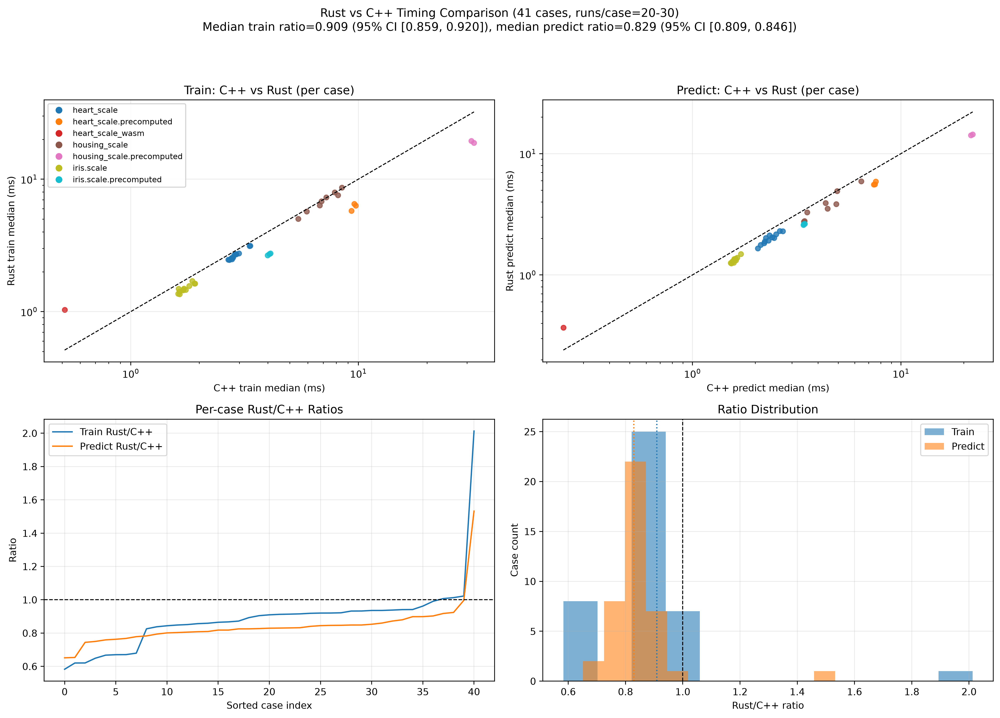

[](https://crates.io/crates/libsvm-rs)
[](https://docs.rs/libsvm-rs)
[](https://github.com/ricardofrantz/libsvm-rs/actions)
[](Cargo.toml)
[](LICENSE)

A pure-Rust implementation of [LIBSVM](https://github.com/cjlin1/libsvm), for
when you want LIBSVM's model and data formats without linking the C/C++ library.
It covers the same SVM types, kernels, sparse text format, model files, and
command-line tools as upstream.

The aim is numerical equivalence, not bitwise identity. A verification pipeline
checks this implementation against a pinned upstream LIBSVM build across
classification, regression, one-class, probability, and precomputed-kernel
cases, and CI compile-checks the core crate for `wasm32-unknown-unknown`.

## What you get

- No C runtime or `libsvm-sys2` FFI dependency
- Reads and writes LIBSVM sparse problem files and model files
- The familiar command-line tools: `svm-train-rs`, `svm-predict-rs`, `svm-scale-rs`
- Solver, kernels, prediction, probability, and I/O all in plain Rust, so you can
  read and test them without crossing an FFI boundary
- One runtime dependency (`thiserror`)
- Reproducible differential tests against a pinned upstream LIBSVM build

## How this differs from the `libsvm` crate

The [`libsvm`](https://docs.rs/libsvm/latest/libsvm/) crate gives you high-level
Rust bindings to the C LIBSVM library through `libsvm-sys2`. Reach for that if
you specifically want the original C implementation.

This crate instead reimplements the LIBSVM algorithms and file formats in Rust.
Reach for it when you want Rust-native deployment, easier cross-compilation, or
code you can inspect and test without an FFI boundary. If you are moving from C
LIBSVM or `libsvm-sys2`, start with [`docs/MIGRATION.md`](docs/MIGRATION.md).

## Performance

Native CLI benchmarks compare the Rust binaries (`svm-*-rs`) against the vendored
C LIBSVM reference on the same datasets and parameters. A ratio below `1.0` means
Rust was faster in the measured run.

| Operation | Cases | Rust/C median ratio |
|---|---:|---:|
| `predict` | 40 | `0.828` |
| `predict_probability` | 30 | `0.838` |
| `train` | 40 | `0.907` |
| `train_probability` | 30 | `0.979` |

Measured on 2026-10-08 (UTC; Linux, AMD Ryzen 9 9900X, 30 runs per command). Rust is
faster at the median for every operation, but not in every case: the slowest
remaining cases are SVR probability training on `housing_scale`, up to
`1.11` times the C time. See
[`reference/benchmark_report.md`](reference/benchmark_report.md) and
[`examples/comparison_summary.json`](examples/comparison_summary.json).

## Parity Status

Current committed verification artifacts against pinned upstream LIBSVM v337:

| Artifact | Scope | Pass | Warn | Fail | Skip |
|---|---:|---:|---:|---:|---:|
| `reference/compare_summary.json` | 70 cases | 65 | 29 | 0 | 5 |
| `reference/differential_report.md` | 250 configs | 237 | 3 | 0 | 10 |

In `compare_summary.json` the warning column counts individual probability
mismatch events, not cases — a case can record warnings and still pass. The
warnings are documented numerical near-parity cases, not prediction-logic
failures. Differential baselines are recorded in the reference artifacts; libc
`rand()` replication exists for macOS and Linux. See
[`reference/differential_report.md`](reference/differential_report.md) and
[`reference/tolerance_policy.md`](reference/tolerance_policy.md).

The differential counts depend on the platform. The suite regenerates its
synthetic datasets and builds upstream LIBSVM with the local compiler. The
committed `reference/differential_report.md` was made on macOS (Apple clang 21,
see `reference/reference_provenance.json`). On Linux (gcc 13) the same code gives
240 pass, 0 warn, 0 fail, 10 skip. To check that a change keeps parity, run the
full suite on the unchanged and on the changed code on the same machine, and
compare the two `reference/differential_results.json` files case by case.

## Security Considerations

`libsvm-rs` treats `.libsvm` problem files and `.model` files as untrusted text
input by default.

- Default loaders enforce byte, line-length, support-vector, class-count, and
  feature-index caps through
  [`LoadOptions`](https://docs.rs/libsvm-rs/latest/libsvm_rs/io/struct.LoadOptions.html).
- Problem files reject malformed `index:value` tokens, non-ascending feature
  indices, over-limit feature indices, oversized input, oversized lines, and
  embedded NUL bytes.
- Model files additionally validate header consistency before support-vector
  allocation: `nr_class`, `total_sv`, `rho`, `label`, `nr_sv`, `probA`,
  `probB`, probability-density marks, precomputed-kernel rows, and non-negative
  `gamma` for gamma-using kernels must agree with the model invariants.
- The optional `serde` model path reuses the same model validation boundary as
  the text loader. Deserializing an `SvmParameter` performs no validation, and
  `svm_train` does not validate either — callers must run
  `SvmParameter::validate()` or `check_parameter(problem, param)` themselves
  unless the parameter came from `SvmParameterBuilder::build()`.
- The optional `rayon` paths consume fold shuffling PRNG state serially before
  parallel work. The glibc-compatible LCG used for parity is not shared across
  workers.
- `SvmParameterBuilder::build()` delegates to `SvmParameter::validate()`; checks
  that need training data remain in `check_parameter(problem, param)`.
- Public loader paths return structured errors for malformed text input within
  the configured caps; they should not panic on adversarial files.

The loaders do not prove that a model is statistically meaningful, was trained
from a specific dataset, is safe to use for a regulated decision, or is
cryptographically authentic. Constant-time arithmetic, side-channel resistance,
sandboxed execution, and model signing are out of scope for this crate. Use
`LoadOptions::trusted_input()` only for files whose source and size are already
controlled.

To report a vulnerability, follow [`SECURITY.md`](SECURITY.md).

## When to Use It

- You are building a Rust service or CLI and want SVM training/prediction
  without a C build or runtime dependency.
- You already have LIBSVM-format data or models and want to keep that workflow;
  see [`docs/MIGRATION.md`](docs/MIGRATION.md) for C LIBSVM and `libsvm-sys2`
  migration notes.
- You need C-SVC, nu-SVC, one-class SVM, epsilon-SVR, or nu-SVR with standard
  LIBSVM kernels.
- You want a small, inspectable Rust implementation for scientific or embedded
  deployment work.

## When Not to Use It

- If you need exact bit-for-bit identity with upstream LIBSVM, use upstream
  LIBSVM directly.
- If you only need Python workflows, scikit-learn already wraps LIBSVM for
  `SVC`, `SVR`, and `OneClassSVM`.
- For very large linear problems, prefer `liblinear`, `LinearSVC`, SGD-style
  methods, or kernel approximations.
- If you need GPU training or online/incremental updates, this crate does not
  provide them.

## Features

- **All 5 SVM types**: C-SVC, nu-SVC, one-class SVM, epsilon-SVR, nu-SVR (`-s 0..4`)
- **All 5 kernel types**: linear, polynomial, RBF, sigmoid, precomputed (`-t 0..4`)
- **Model file compatibility**: reads and writes LIBSVM text format at `%.17g` precision, so a model trained with the C library loads in Rust and vice versa
- **Optional serde support**: enable the `serde` feature to serialize `SvmModel`/`SvmParameter` inside a Rust application's own state (for example JSON or bincode). Deserialization reuses the model validation boundary, but this is not a C/LIBSVM interchange format; use `save_model`/`load_model` text files for compatibility with other LIBSVM tools.
- **Probability estimation** (`-b 1`): Platt scaling for binary classification, pairwise coupling for multiclass, Laplace-corrected regression, density marks for one-class
- **Cross-validation**: stratified k-fold for classification (preserves class proportions), simple k-fold for regression and one-class. Enable the optional `rayon` feature to train CV folds in parallel while keeping fold assignment serial and deterministic; default builds still avoid the `rayon` dependency. Parallel fold diagnostics are suppressed to avoid interleaved output. Peak memory can include up to `min(k, rayon_threads)` simultaneous kernel caches of `SvmParameter::cache_size` each; the cache size is never silently divided.
- **CLI tools**: `svm-train-rs`, `svm-predict-rs`, `svm-scale-rs`, matching upstream flag syntax

### Cargo feature flags

Cargo features are opt-in. The default feature set is empty (`default = []`), so
library builds keep the single runtime dependency on `thiserror` unless you
enable an optional feature:

- `serde`: enables `Serialize`/`Deserialize` for model and parameter types.
- `rayon`: enables parallel cross-validation folds; serial behavior remains the
  default.

## Installation

### As a library

```toml
[dependencies]
libsvm-rs = "0.9.0"
```

MSRV is Rust `1.80` for all builds.

### CLI tools

```bash
# Clone and build from source (CLIs are workspace members, not published separately)
git clone https://github.com/ricardofrantz/libsvm-rs.git
cd libsvm-rs
cargo build --release -p svm-train-rs -p svm-predict-rs -p svm-scale-rs
# Binaries are in target/release/
```

## Quick Start

### Library API

```rust
use libsvm_rs::io::{load_problem, save_model, load_model};
use libsvm_rs::predict::{predict, predict_values};
use libsvm_rs::train::svm_train;
use libsvm_rs::{KernelType, SvmParameter, SvmParameterBuilder, SvmType};
use std::path::Path;

// Load training data in LIBSVM sparse format
let problem = load_problem(Path::new("data/heart_scale")).unwrap();

// Configure parameters with the builder (defaults match LIBSVM)
let param = SvmParameterBuilder::new()
    .svm_type(SvmType::CSvc)
    .kernel_type(KernelType::Rbf)
    .gamma(1.0 / 13.0)  // 1/num_features
    .c(1.0)
    .build()
    .unwrap();

// Direct struct construction is also public API.
let _direct_param = SvmParameter {
    svm_type: SvmType::CSvc,
    kernel_type: KernelType::Rbf,
    gamma: 1.0 / 13.0,
    c: 1.0,
    ..SvmParameter::default()
};

// Train
let model = svm_train(&problem, &param);

// Predict a single instance
let label = predict(&model, &problem.instances[0]);
println!("predicted label: {label}");

// Get decision values (useful for ranking or custom thresholds)
let mut dec_values = vec![0.0f64; model.nr_class * (model.nr_class - 1) / 2];
let label = predict_values(&model, &problem.instances[0], &mut dec_values);
println!("decision values: {dec_values:?}");

// Save/load models (compatible with C LIBSVM format)
save_model(Path::new("heart_scale.model"), &model).unwrap();
let loaded = load_model(Path::new("heart_scale.model")).unwrap();
```

### Cross-Validation

```rust
use libsvm_rs::cross_validation::svm_cross_validation;

let targets = svm_cross_validation(&problem, &param, 5);  // 5-fold CV
let accuracy = targets.iter().zip(&problem.labels)
    .filter(|(pred, actual)| (*pred - *actual).abs() < 1e-10)
    .count() as f64 / problem.labels.len() as f64;
println!("CV accuracy: {:.2}%", accuracy * 100.0);
```

### Probability Estimation

```rust
use libsvm_rs::predict::predict_probability;

// Enable probability estimation during training
let mut param = SvmParameter::default();
param.probability = true;
param.kernel_type = KernelType::Rbf;
param.gamma = 1.0 / 13.0;

let model = svm_train(&problem, &param);
if let Some((label, probs)) = predict_probability(&model, &problem.instances[0]) {
    println!("label: {label}, class probabilities: {probs:?}");
}
```

### Extended Examples

For structured, runnable example suites see:

- `docs/MIGRATION.md` — migration guide for C LIBSVM and `libsvm-sys2` users
- `examples/README.md` — index of all examples
- `examples/basics/` — minimal starter examples
- `examples/api/` — persistence, CV/grid-search, Iris workflow
- `examples/integrations/` — prediction server + wasm inference integrations
- `examples/scientific/` — benchmark-heavy Rust-vs-C++ demos

## CLI Usage

The CLI tools accept the same flags as upstream LIBSVM:

### svm-train-rs

```bash
# Default C-SVC with RBF kernel
svm-train-rs data/heart_scale

# nu-SVC with linear kernel, 5-fold cross-validation
svm-train-rs -s 1 -t 0 -v 5 data/heart_scale

# epsilon-SVR with RBF, custom C and gamma
svm-train-rs -s 3 -t 2 -c 10 -g 0.1 data/heart_scale

# With probability estimation
svm-train-rs -b 1 data/heart_scale

# With class weights for imbalanced data
svm-train-rs -w1 2.0 -w-1 0.5 data/heart_scale

# Quiet mode (suppress training progress)
svm-train-rs -q data/heart_scale
```

### svm-predict-rs

```bash
# Standard prediction
svm-predict-rs test_data model_file output_file

# With probability estimates
svm-predict-rs -b 1 test_data model_file output_file

# Quiet mode
svm-predict-rs -q test_data model_file output_file
```

### svm-scale-rs

```bash
# Scale features to [0, 1]
svm-scale-rs -l 0 -u 1 data/heart_scale > scaled.txt

# Scale to [-1, 1] (default)
svm-scale-rs data/heart_scale > scaled.txt

# Save scaling parameters for later use on test data
svm-scale-rs -s range.txt data/heart_scale > train_scaled.txt
svm-scale-rs -r range.txt data/test_data > test_scaled.txt

# Scale specific feature range
svm-scale-rs -l 0 -u 1 -y -1 1 data/heart_scale > scaled.txt
```

---

## Verification Pipeline

### Overview

Upstream parity is locked to LIBSVM `v337` (December 2025) via `reference/libsvm_upstream_lock.json`. The differential verification suite builds the upstream C binary from a pinned Git commit, runs both implementations on identical datasets with identical parameters, and compares:

- **Prediction labels**: exact match for classification, tolerance-bounded for regression
- **Decision values**: relative and absolute tolerance checks
- **Model structure**: number of SVs, rho values, sv_coef values
- **Probability outputs**: probA/probB parameters, probability predictions

### Running Verification

```bash
# 1. Validate that the upstream lock file is consistent
bash scripts/check_libsvm_reference_lock.sh

# 2. Build the pinned upstream C reference binary and record provenance
bash scripts/setup_reference_libsvm.sh

# 3. Run differential verification
#    Quick scope: 45 configs (canonical datasets × SVM types × kernel types)
python3 scripts/run_differential_suite.py

#    Full scope: 250 configs (canonical + generated + tuned parameters)
DIFF_SCOPE=full python3 scripts/run_differential_suite.py

#    Strict mode: disable the targeted SVR warning downgrade
DIFF_ENABLE_TARGETED_SVR_WARN=0 DIFF_SCOPE=full python3 scripts/run_differential_suite.py

#    Sensitivity study: override the global non-probability relative tolerance
DIFF_NONPROB_REL_TOL=2e-5 DIFF_SCOPE=full python3 scripts/run_differential_suite.py

# 4. Run coverage gate (checks line and function coverage thresholds)
bash scripts/check_coverage_thresholds.sh

# 5. Run Rust-vs-C performance benchmarks
BENCH_WARMUP=3 BENCH_RUNS=30 python3 scripts/benchmark_compare.py
```

### Understanding Differential Results

| Verdict | Meaning |
|---------|---------|
| `pass`  | No parity issues detected under configured tolerances |
| `warn`  | Non-fatal differences detected under explicit, documented policy rules |
| `fail`  | Deterministic parity break — label mismatch or model divergence outside thresholds |
| `skip`  | Configuration not executed (usually because training fails in both implementations) |

Current full-scope status in `reference/differential_report.md` (250 configs,
macOS reference run): 237 pass, 3 warn, 0 fail, 10 skip.

The 3 warnings are:
1. `housing_scale_s3_t2_tuned` — epsilon-SVR near-parity training drift (bounded, cross-predict verified)
2. `gen_extreme_scale_scale_s0_t1_default` — rho-only header drift
3. `gen_extreme_scale_scale_s2_t1_default` — one-class near-boundary label drift

All 10 skips are configurations not executed by the full differential suite.
`reference/compare_summary.json` records the current summary comparison artifact
as 65 pass, 29 warn, 0 fail, 5 skip.

The active tolerance policy is `differential-v3` (documented in `reference/tolerance_policy.md`).

### Targeted Warning Policy

The epsilon-SVR warning for `housing_scale_s3_t2_tuned` has an intentionally narrow guard:

- Applies to **one case ID only**
- Non-probability drift bounds must hold: `max_rel <= 6e-5`, `max_abs <= 6e-4`
- Model drift bounds must hold: `rho_rel <= 1e-5`, `max sv_coef abs diff <= 4e-3`
- **Cross-predict parity** must hold in both directions:
  - Rust predictor on C model matches C predictor on C model
  - C predictor on Rust model matches Rust predictor on Rust model

This confirms the drift comes from training numerics, not prediction logic.

### Verification Artifacts

| Category | Files |
|----------|-------|
| Lock & provenance | `reference/libsvm_upstream_lock.json`, `reference/reference_provenance.json`, `reference/reference_build_report.md` |
| Differential | `reference/differential_results.json`, `reference/differential_report.md` |
| Tolerance | `reference/tolerance_policy.md` |
| Coverage | `reference/coverage_report.md` |
| Performance | `reference/benchmark_results.json`, `reference/benchmark_report.md` |
| Datasets | `reference/dataset_manifest.json`, `data/generated/` |
| Security | `deny.toml`, `crates/libsvm/fuzz/README.md`, `CHANGELOG.md` |

### Rust vs C++ Timing Figure

Global timing comparison figure (train + predict, per-case ratios, and ratio distributions):



Statistical summary companion:
- `examples/comparison_summary.json`

To regenerate performance data with stronger statistical confidence before plotting:

```bash
BENCH_WARMUP=3 BENCH_RUNS=30 python3 scripts/benchmark_compare.py
python3 examples/common/make_comparison_figure.py --root . --out examples/comparison.png --summary examples/comparison_summary.json
```

### Parity Claim

No hard differential failures under the default policy, with a small set of
documented, justified warnings — good parity evidence, though not bitwise
identity across all modes. The residual drift comes from training-side numerics
(floating-point accumulation order, shrinking-heuristic timing), not from
prediction logic.

---

## Architecture

The library crate is in `crates/libsvm/` and the three CLI tools are in `bins/`.
[`docs/ARCHITECTURE.md`](docs/ARCHITECTURE.md) describes each module, the SMO
solver, the design decisions, and the notes on numerical equivalence.

## Test Coverage

| Category | Tests | Description |
|----------|-------|-------------|
| Cache | 7 | LRU eviction, extend, swap with column updates |
| Kernel | 12 | All kernel types, struct/standalone agreement, sparse dot product |
| QMatrix | 4 | SvcQ sign/symmetry, OneClassQ, SvrQ double buffer |
| I/O | 48 | Problem parsing, model roundtrip, C format compatibility, `LoadOptions` caps, malformed-header rejection |
| Types | 14 | Parameter validation, nu-SVC feasibility checks |
| Builder | 7 | `SvmParameterBuilder` validation and defaults |
| Predict | 5 | Heart_scale accuracy, C svm-predict output comparison |
| Train | 8 | C-SVC, multiclass, nu-SVC, one-class, epsilon-SVR, nu-SVR |
| Probability | 10 | Sigmoid fitting, binary/multiclass/regression probability |
| Cross-validation | 6 | Stratified CV, classification accuracy, regression MSE |
| Property | 6 | Proptest-based invariant checks (random params/data) |
| Metrics | 6 | Regression MSE/R², classification accuracy, edge cases |
| Util | 9 | group_classes, parse_feature_index, shuffle_range |
| Malicious input | 20 | Hostile problem files, model files, and serde payloads are rejected |
| Serde | 4 | JSON roundtrip of models; enums keep LIBSVM integer codes |
| Rayon parity | 1 | Cross-validation output matches one bit-level snapshot with and without `rayon` |
| CLI integration | 28 | Train/predict/scale end-to-end, flag permutation fuzzing |
| Doc tests | 8 | Examples in the API docs (1 ignored) |
| Differential | 250 | Full Rust-vs-C comparison matrix (via external suite) |
| **Unit/integration/doc** | **202 pass, 1 ignored** | `cargo test --workspace --all-features` |

Coverage metrics: 93.24% line coverage, 94.35% function coverage (library crate), from [`reference/coverage_report.md`](reference/coverage_report.md).

## Dependencies

- **Runtime**: `thiserror` (error derive macros)
- **Optional**: `serde` (feature-gated serialization), `rayon` (feature-gated parallel cross-validation)
- **Dev**: `float-cmp` (approximate float comparison), `criterion` (benchmarks), `proptest` (property-based testing)

## Known Limitations

1. **Not bitwise identical**: In the differential suite, non-probability outputs agree with C LIBSVM within relative `1.5e-5` and absolute `1e-8`, except one documented epsilon-SVR case in the macOS reference run (`housing_scale_s3_t2_tuned`, relative drift up to `5.7e-5`). Probability outputs have looser tolerances (see `reference/tolerance_policy.md`). Results are not bit-for-bit identical because floating-point accumulation order differs.
2. **No GPU support**: All computation is CPU-based.
3. **No incremental/online learning**: Full retraining required for new data (same as upstream LIBSVM).
4. **Precomputed kernels require full matrix**: The full n×n kernel matrix must be provided in memory.

## Contributing

1. Fork the repository
2. Create a feature branch
3. Run the test suite: `cargo test --workspace`
4. Run the full differential suite (`DIFF_SCOPE=full python3 scripts/run_differential_suite.py`) on the unchanged and on the changed code on the same machine, and confirm the results match
5. Submit a pull request

## License

`libsvm-rs` is licensed under **BSD-3-Clause**, the same license as upstream
LIBSVM. It is a Rust port and reimplementation of
[LIBSVM](https://github.com/cjlin1/libsvm) by Chih-Chung Chang and Chih-Jen Lin;
the original algorithm and copyright belong to them, and that copyright is
retained alongside the Rust port's. The original LIBSVM source is redistributed
verbatim under `vendor/libsvm/` with its own license at
[`vendor/libsvm/COPYRIGHT`](vendor/libsvm/COPYRIGHT).

See [LICENSE](LICENSE) for terms and [NOTICE](NOTICE) for provenance and
attribution.

## References

- Chang, C.-C. and Lin, C.-J. (2011). LIBSVM: A library for support vector machines. *ACM Transactions on Intelligent Systems and Technology*, 2(3):27.
- Platt, J.C. (2000). Probabilities for SV machines. In *Advances in Large Margin Classifiers*, MIT Press.
- Lin, H.-T., Lin, C.-J., and Weng, R.C. (2007). A note on Platt's probabilistic outputs for support vector machines. *Machine Learning*, 68(3):267–276.
- Fan, R.-E., Chen, P.-H., and Lin, C.-J. (2005). Working set selection using second order information for training support vector machines. *JMLR*, 6:1889–1918.

## Disclaimer

This software is provided "as is", without warranty of any kind. To the extent
permitted by law, the authors and contributors are not liable for any damage, loss
or claim arising from its use or misuse. You are responsible for how you use it and
for following the laws and rules that apply to you. The full terms are in
[LICENSE](LICENSE).

This is research software. It has not been validated for engineering design,
certification or safety-critical use. Check its results independently before you
rely on them.
